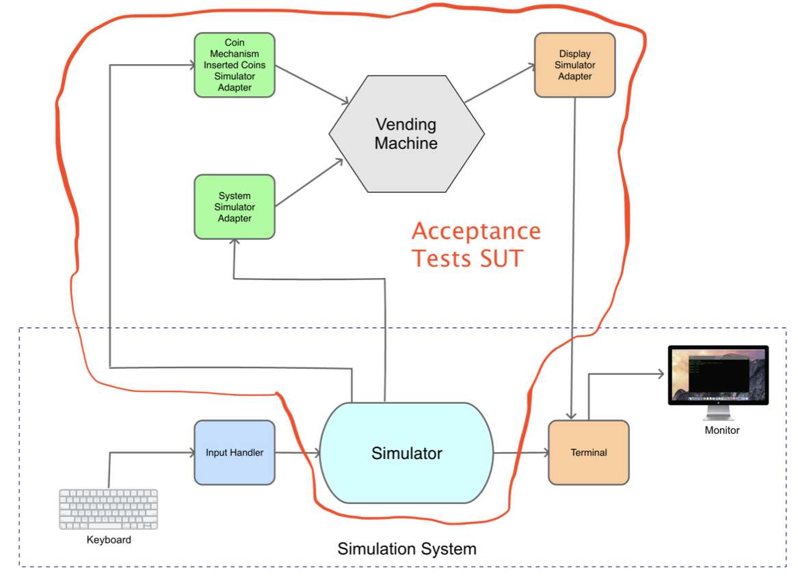
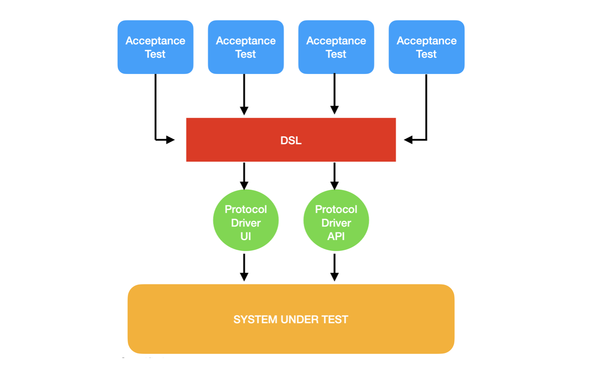

# Developer's Log, 2024.04.01

## Progress

* __Done:__ Implement the 4 Layer Approach to writing acceptance tests and write tests for the Accept Coins story.

First let's talk about what parts of the system are being tested SUT (System Under Test). The acceptance tests (not including [smoke-test.spec.ts](https://github.com/WoodyB/vending-machine-project/blob/main/test/acceptance/smoke-test.spec.ts)) are testing everything I have drawn a red line around. I talked about a judgement call of what is a reasonable production like environment for the acceptance tests in the previous log entry [2024.03.29](https://github.com/WoodyB/vending-machine-project/blob/main/design/developers-log/2024.03.29.md)



Originally, I was planing to include Terminal inside the redline but to do that I would have to hijack Node's console.log() which is doable. However, I decided it could cause us a lot of trouble. You never know when you may want to put in a temporary console.log() in to help debug. If we look at the code in Terminal, it just isn't doing much. See below.

``` javascript
import { TerminalInterface } from './interfaces';

export class Terminal implements TerminalInterface {
    output(str: string): void {
      console.log(str);
    }
  }
```

It's pretty much just calling console.log(). We do test Terminal and InputHandler in [smoke-test.spec.ts](https://github.com/WoodyB/vending-machine-project/blob/main/test/acceptance/smoke-test.spec.ts) so it's better to use a fake Terminal as a test measuring point. We use a special fake version that allows us to capture anything being displayed.

So using a fake Terminal to capture output and an instrumented inputHandler to simulate the user pressing keys on the keyboard allows us to cover most of the system.

Let's look at the new acceptance test. It's short enough I'll just show you what it looks like at the time of this log entry here.

``` javascript
import { determineProtocolDriver } from '../DSL/determineProtocolDriver';
import { Coins } from '../../src/types'
import {VM_STR_INSERT_COIN } from '../../src/constants/vending-machine-strings'

describe("Vending Machine", () => {
    const driver = determineProtocolDriver();

    beforeEach(async () => {
        await driver.setup();
    });

    afterEach(async () => {
        await driver.teardown();
    });

    it(`should display ${VM_STR_INSERT_COIN}`, async () => {
        const foundInsertCoin = await driver.verifyDisplayOutput(VM_STR_INSERT_COIN);
        expect(foundInsertCoin).toBe(true);
    });

    it("should accept a quarter and display its value", async () => {
        await driver.insertCoin(Coins.QUARTER);
        const foundDisplay25Cents = await driver.verifyDisplayOutput('0.25');
        expect(foundDisplay25Cents).toBe(true);
    });

    it("should accept a dime and display its value", async () => {
        await driver.insertCoin(Coins.DIME);
        const foundDisplay10Cents = await driver.verifyDisplayOutput('0.10');
        expect(foundDisplay10Cents).toBe(true);
    });

    it("should accept a nickel and display its value", async () => {
        await driver.insertCoin(Coins.NICKEL);
        const foundDisplay5Cents = await driver.verifyDisplayOutput('0.05');
        expect(foundDisplay5Cents).toBe(true);
    });

    it("should accept a quarter, a dime and a nickel and display 40 cents ", async () => {
        await driver.insertCoin(Coins.QUARTER);
        await driver.insertCoin(Coins.DIME);
        await driver.insertCoin(Coins.NICKEL);
        const foundDisplay5Cents = await driver.verifyDisplayOutput('0.40');
        expect(foundDisplay5Cents).toBe(true);
    });
});
```

I'm pretty pleased with these tests. If you compare this with the experimental tests I talked about in the previous log entry [2024.03.29](https://github.com/WoodyB/vending-machine-project/blob/main/design/developers-log/2024.03.29.md) I think you would agree this looks much simpler.

I like to think if someone that doesn't write software would still have a pretty good idea of what these tests are doing. In the 4 Layer Approach I talked about before this is the top layer and the tests and are written in the language of the DSL (e.g. insertCoin())

I think there's an excellent chance that I will create this project again in the near future but with a NodeJS backend using REST endpoints and a React frontend. These tests will likely not need to be changed. I will just need to write new protocol drivers.



If you would like to see how I implemented the DSL and protocol drivers at the time of this log entry you can see that [here](https://github.com/WoodyB/vending-machine-project/tree/rc-491/test/DSL)

I really liked the way my high level tests turned out but I'm not sure all this code I wrote underneath them. If you have some better ideas I'm open to considering them. Just drop me line in [Discussions](https://github.com/WoodyB/vending-machine-project/discussions) or reach out on [LinkedIn](https://www.linkedin.com/in/woody-beverley-99a4b716/). That said, let me point out some of the features.

* Using an abstract BaseDriver class
* I'm showing two protocol drivers just to demo what it would like to have more than one. STDIOProtocolDriver doesn't do anything and probably never will.
* determineProtocolDriver allows us to override the default protocol driver and specify a different one on the command line. I've used this trick in the past for running acceptance tests using a protocol driver I wouldn't use in a CD Pipeline but sill like to see the results. For example maybe run all the acceptance tests every night using the UI protocol driver (i.e. testing though a browser ui via Playwright) while the CD Pipeline only uses the API protocol driver for speed and non flakiness.

## What I hope to have done by next log update

* Finish the Accept Coins story implementation. Currently not handling inserted non-valid coins.
* Begin implementing Select Product story
